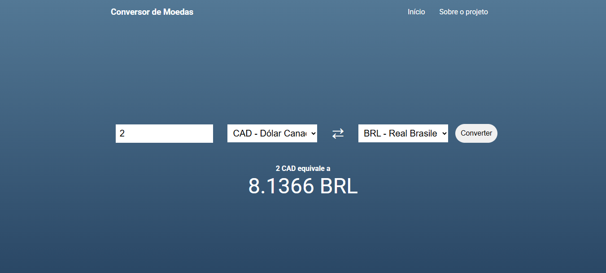

<section>
  <h1>Conversão de Moedas</h1>
  <h3>Site para realizar conversões de moedas. Foi feito utilizando Angular / <a href="https://www.exchangerate-api.com/" target="_blank">ExchangeRate API</a>. Acesse <a href="https://fellypesouza.github.io/Conversao-de-Moedas/" target="_blank">aqui</a>.</h3>
  <section>
    
    
  </section>
  <section>
    <h3>🌍 Conversões</h3>
    <h4>O sistema suporta conversões entre as principais moedas globais. Aqui estão as 10 mais utilizadas disponíveis:</h4>
    <ul>
      <li><strong>USD</strong> - Dólar Americano</li>
      <li><strong>EUR</strong> - Euro</li>
      <li><strong>JPY</strong> - Iene Japonês</li>
      <li><strong>CNY</strong> - Yuan Chinês</li>
      <li><strong>AUD</strong> - Dólar Australiano</li>
      <li><strong>CAD</strong> - Dólar Canadense</li>
      <li><strong>CHF</strong> - Franco Suíço</li>
      <li><strong>HKD</strong> - Dólar de Hong Kong</li>
      <li><strong>INR</strong> - Rupia Indiana</li>
      <li><strong>BRL</strong> - Real Brasileiro</li>
    </ul>
  </section>
</section>
